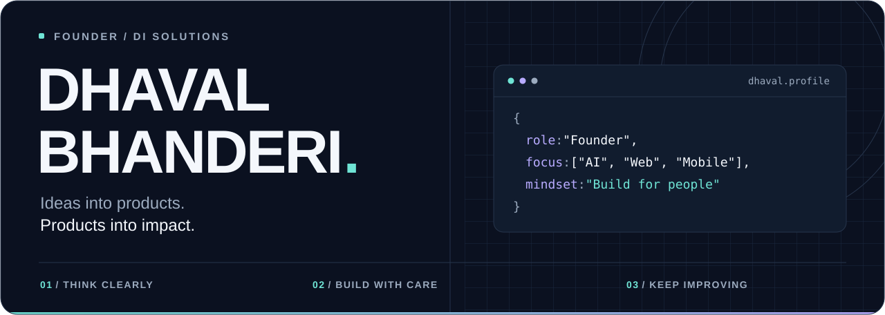
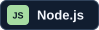
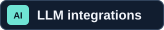
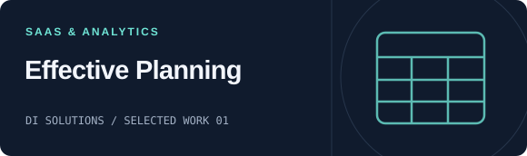
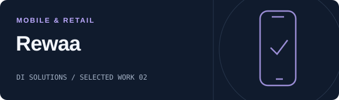
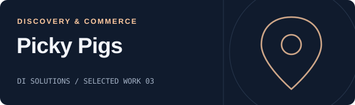
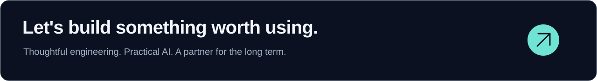

<!--
  DI Solutions | GitHub profile README
  Keep README.md at the root of your public username/username repository.
  Upload the entire assets folder with this file. No username is hard-coded.
  Publishing instructions: docs/SETUP.md. Content notes: docs/SOURCES.md.
-->

<picture>
  <source media="(prefers-color-scheme: dark)" srcset="./assets/hero-dark.svg">
  <source media="(prefers-color-scheme: light)" srcset="./assets/hero-light.svg">
  
</picture>

 

  
  &nbsp;
  
  &nbsp;
  

  <strong>AI-powered products &nbsp; &middot; &nbsp; Web &amp; mobile engineering &nbsp; &middot; &nbsp; Long-term partnerships</strong> 
  Based in Surat, India. Building with teams around the world.

---

## Hello, we're DI Solutions.

We partner with startups and growing businesses to turn ideas into useful software, combining product thinking, engineering, and a team that cares about the outcome.

We build across **web, mobile, enterprise software, cloud, and AI**. Our goal is simple: make technology easier to use, easier to scale, and valuable to the business behind it.

> Understand the problem. Build with purpose. Keep making it better.

## What we build

<table>
  <tr>
    <td width="50%" valign="top">
      
      <h3>AI that fits the workflow</h3>
      
AI assistants, LLM integrations, MCP servers, and automation connected to real business tools.

      <a href="https://disolutions.net/services/aiml-services">Explore AI services &rarr;</a>
    </td>
    <td width="50%" valign="top">
      
      <h3>Web products built to grow</h3>
      
SaaS platforms, customer portals, dashboards, and custom business applications.

      <a href="https://disolutions.net/case-study/effective-planning">See a SaaS case study &rarr;</a>
    </td>
  </tr>
  <tr>
    <td width="50%" valign="top">
      
      <h3>Mobile experiences that work</h3>
      
Cross-platform and native apps, from customer-facing experiences to connected business operations.

      <a href="https://disolutions.net/case-study/rewaa">See a mobile case study &rarr;</a>
    </td>
    <td width="50%" valign="top">
      
      <h3>The systems behind the product</h3>
      
APIs, cloud deployments, third-party integrations, and modernization of existing software.

      <a href="https://disolutions.net/hire-us/hire-dotnet-developers">Explore backend engineering &rarr;</a>
    </td>
  </tr>
</table>

## Technology across DI Solutions

A selection of the technologies and capabilities we use across our projects.

<table>
  <tr>
    <td><strong>Web &amp; frontend</strong></td>
    <td>   </td>
  </tr>
  <tr>
    <td><strong>Backend &amp; APIs</strong></td>
    <td>  </td>
  </tr>
  <tr>
    <td><strong>Mobile</strong></td>
    <td>   </td>
  </tr>
  <tr>
    <td><strong>Cloud &amp; data</strong></td>
    <td>    </td>
  </tr>
  <tr>
    <td><strong>AI &amp; automation</strong></td>
    <td>   </td>
  </tr>
</table>

## Selected work from our team

A few highlights from the **[DI Solutions public portfolio](https://disolutions.net/case-study)**.

<table>
  <tr>
    <td width="50%" valign="top">
      
      <h3><a href="https://disolutions.net/case-study/effective-planning">Effective Planning</a></h3>
      
A SaaS budgeting platform with customizable dashboards, data imports, and planning workflows.

      
<code>.NET MVC</code> <code>AngularJS</code> <code>SQL Server</code>

    </td>
    <td width="50%" valign="top">
      
      <h3><a href="https://disolutions.net/case-study/rewaa">Rewaa</a></h3>
      
A retail web-to-mobile transformation with offline operation, barcode scanning, POS, and payment integrations.

      
<code>Ionic</code> <code>Node.js</code> <code>Retail operations</code>

    </td>
  </tr>
  <tr>
    <td width="50%" valign="top">
      
      <h3><a href="https://disolutions.net/case-study/picky-pigs">Picky Pigs</a></h3>
      
Restaurant discovery shaped around dietary preferences, allergies, and lifestyle, with QR-based ordering.

      
<code>Personalized discovery</code> <code>Ordering</code>

    </td>
    <td width="50%" valign="top">
      
      <h3><a href="https://disolutions.net/case-study/hangtime-hobby-meetup">Hangtime: Hobby Meetup</a></h3>
      
A community app connecting people through shared interests, local meetups, hobby groups, and real-time chat.

      
<code>Community</code> <code>Events</code> <code>Real-time chat</code>

    </td>
  </tr>
</table>

  
<strong>A little more about how we approach a project</strong>

### Start with the problem, not the stack.

What needs to improve? Who will use it? What does a successful release look like? Getting those answers right is part of the engineering work.

### Keep the foundations clear.

Choose technology that fits the product, make integrations understandable, and leave the next developer a codebase they can work with.

### Treat launch as a beginning.

Feedback, maintenance, and steady improvements matter just as much as the first release.

<!-- Optional GitHub activity cards can be added here after the username is confirmed.
     See docs/OPTIONAL-STATS.md. The default profile has no third-party image dependencies. -->

 

<a href="https://disolutions.net/contact-us">
  <picture>
    <source media="(prefers-color-scheme: dark)" srcset="./assets/footer-dark.svg">
    <source media="(prefers-color-scheme: light)" srcset="./assets/footer-light.svg">
    
  </picture>
</a>

  <a href="https://www.linkedin.com/in/dhavalbhanderi/"><strong>Connect on LinkedIn</strong></a>
  &nbsp; &middot; &nbsp;
  <a href="https://disolutions.net/">Visit DI Solutions</a>
  &nbsp; &middot; &nbsp;
  <a href="mailto:solutions@disolutions.net">Business enquiries</a>

